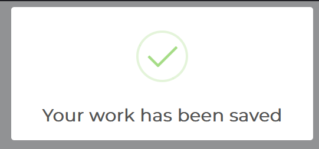
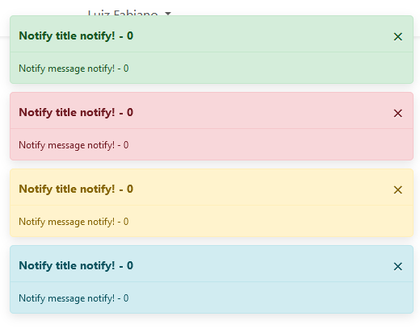
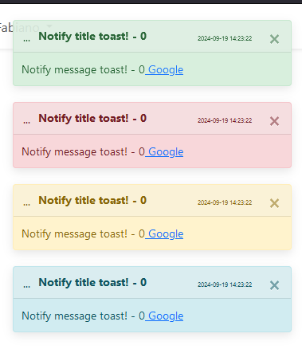

<p align="center"></p>

# SSE-NOTIFY

[](//packagist.org/packages/luizfabianonogueira/sse-notify)
[](//packagist.org/packages/luizfabianonogueira/sse-notify)
[](//packagist.org/packages/luizfabianonogueira/sse-notify)
[](//packagist.org/packages/luizfabianonogueira/sse-notify)

## Description

If you’re developing with Laravel and looking for an effective way to interact with your users in real time, your solution is here! With **[Sse-Notify]**, you can:

## 💡 Real-Time Notifications
Leverage the power of **SSE (Server-Sent Events)** to effortlessly send notifications from the **server to the client**, ensuring a smooth, real-time user experience!

## 🔔 Multiple Notification Options
Choose from various styles and modes of notification:
- Traditional **JavaScript Alerts**
- Modern notifications with **Bootstrap Notify**
- Sleek messages with **Bootstrap Toast**
- Visually stunning pop-ups with **SweetAlert2**
- **HTML and JavaScript Injection** for dynamic content

## 🎯 Infinite Flexibility
With support for **dynamic HTML and JavaScript injection**, the possibilities are literally endless! Create unique and personalized interactions tailored to your project and user needs.

## ⚙️ Easy Integration
**[Sse-Notify]** is simple to integrate with your Laravel project. Just install the package and start harnessing the power of SSE communication to elevate your user notifications.

## 👉 Ready to transform how you interact with your users?
Try **[Sse-Notify]** and discover how easy it is to take your notifications to the next level!

## Requirements
PHP 8.2 or higher \
Laravel 10.0 or higher \
User table with id uuid column \
Active authentication system \
Active uuid extension in database

## Installation

```shell
composer require luizfabianonogueira/sse-notify
```

After installation, register the service provider.\

In bootstrap/providers.php.
```php
<?php
return [
    // other providers...
    LuizFabianoNogueira\SseNotify\SseServiceProvider::class, 
];
```
After that you must publish the migration and js file.

```shell    
php artisan vendor:publish --tag=sse-notify-migrations
php artisan vendor:publish --tag=sse-notify-assets
```
Attention: the sse.js file will be exported to public/assets/js/sse.js. \
If you use Vite or similar tools, configure js correctly to be loaded.

Execute the migration to create the table that will store the notifications.

```shell    
php artisan migrate
```

Now we need to configure the communication channel. 

In the view you chose to have the channel open, insert the following code.

```html
    @if(Auth::check())
        <!-- Include the sse.js file -->
        <script src="{{ asset('assets/js/sse.js') }}"></script>
        <script>
            <!-- Call the SseConnect function passing the route to the connection -->
            SseConnect('{{ route('sse.connect', ['userId' => Auth::user()->id]) }}');
        </script>
    @endif
```

## Testing
To run a user test, simply access the following url

yourdomain.com/sse/generateFakeData/{userId}

## Usage Example

### ..::|| javaScript alert() ||::..

```php
    $sseMessageAlert = new SseEventMessageAlert([
        'message' => 'Notify Alert!', //string
        'userId' => {userId}, //uuid
    ]);
    $sseMessageAlert->save();
```

### ..::|| SweetAlert2 ||::..
```php
$data = [
    'title' => 'Notify title Sweet!', //string
    'message' => 'Notify message Sweet!', //string
    'type' => SseEnumStyle::STYLE_SUCCESS, //Enum types: STYLE_SUCCESS, STYLE_ERROR, STYLE_WARNING, STYLE_INFO
    'id' => time(),// int id unique
    'confirm' => false, // if true show confirm button
    'userId' => $this->userId //uuid - user to be notified
];
(new SseEventMessageSweet($data))->save();
```


### ..::|| Bootstrap Notify ||::..
```php
$data = [
    'title' => 'Notify title notify!', //string
    'message' => 'Notify message notify!', //string
    'type' => SseEnumStyle::STYLE_SUCCESS, //Enum types: STYLE_SUCCESS, STYLE_ERROR, STYLE_WARNING, STYLE_INFO
    'id' => time(), // int id unique
    'autoClose' => true, // if true auto close
    'userId' => $this->userId //uuid - user to be notified
];
(new SseEventMessageNotify($data))->save();
```


### ..::|| Bootstrap TOAST ||::..
```php
$data = [
    'title' => 'Notify title toast!', //string
    'message' => 'Notify message toast!', //string   
    'type' => SseEnumStyle::STYLE_SUCCESS, //Enum types: STYLE_SUCCESS, STYLE_ERROR, STYLE_WARNING, STYLE_INFO
    'id' => time(), // int id unique
    'autoClose' => true, // if true auto close
    'userId' => $this->userId, //uuid - user to be notified
    'imgURL' => '/android-chrome-192x192.png', //string - image url [optional]
    'linkURL' => 'https://www.google.com', //string - link url [optional]
    'linkText' => 'Google' //string - link text [optional]
];
(new SseEventMessageToast($data))->save();
```


### ..::|| INJECTION HTML ||::..
```php
(new SseEventInjectHtml([
    'html' => '<div class="alert alert-success">Notify message!</div>', //string - html to be injected 
    'target' => 'boxTestes', //string - target id to inject
    'userId' => $this->userId //uuid - user to be notified
]))->save();
```

### ..::|| INJECTION SCRIPT ||::..
```php
(new SseEventInjectScript([
    'script' => 'console.log("Notify message! - ' . $i . '")', //string - script to be injected
    'userId' => $this->userId //uuid - user to be notified
]))->save();
```

After saving, the system sends the notification to the target user. \
Each notification has a 3 seconds interval between them. \
If you don't have notifications, the next check is in 10 seconds.


### License: LGPL-3.0-or-later

___
___

## Contact & Support

[](https://www.linkedin.com/in/luiz-fabiano-nogueira-b20875170/)
[](https://api.whatsapp.com/send?phone=5548991779088)
[](https://github.com/LuizFabianoNogueira)
[](https://packagist.org/packages/luizfabianonogueira/)

📞 **Phone:** [+5548991779088](tel:+5548991779088)  
✉️ **Email:** [luizfabianonogueira@gmail.com](mailto:luizfabianonogueira@gmail.com)

---

### Support My Work

If you enjoyed this project and would like to support my work, any donation via Pix is greatly appreciated!  
Feel free to donate using one of the following Pix keys:

💳 **Email Pix Key:** `luizfabianonogueira@gmail.com`  
📱 **Phone Pix Key:** `48991779088`

Thank you for your support!

